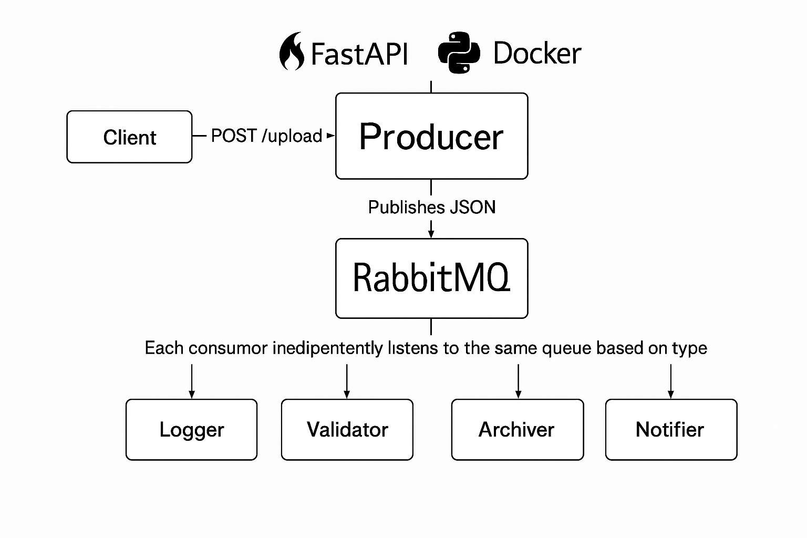

# Event-Driven File System

An advanced event-driven system built using **FastAPI**, **RabbitMQ**, and **Docker** for managing file uploads and processing in real-time. The system uses **Poetry** for dependency management, ensuring easy setup and environment management.



## Project Overview

This project demonstrates the use of **Event-Driven Architecture** (EDA) to create an application that reacts to events (like file uploads). Using **RabbitMQ** as the message broker, the system decouples components such as file uploading, validation, and logging.

### Key Concepts:

- **Event-Driven Architecture**: Systems that react to events, such as changes or user actions.
- **FastAPI**: A high-performance web framework for building APIs in Python.
- **RabbitMQ**: A message broker that facilitates communication between services through queues.
- **Docker**: Platform for developing, shipping, and running applications in containers.
- **Poetry**: Dependency management and packaging tool for Python.

---

## Features

- **File Upload API**: Allows users to upload files with validation.
- **Message Queue**: Files are processed asynchronously using RabbitMQ, ensuring that the upload service doesn’t block other operations.
- **Real-time Processing**: Files are validated and processed in real-time with RabbitMQ consumers.
- **Poetry for Dependency Management**: The project uses Poetry to handle Python dependencies and virtual environments.

---

## Getting Started

### Prerequisites

- Docker
- Python 3.10 or above
- Poetry (for managing Python dependencies)

If you don't have **Poetry** installed, you can follow the [installation guide here](https://python-poetry.org/docs/#installation).

### Setting Up the Project

1. **Clone the repository:**

   ```bash
   git clone https://github.com/SYED-M-HUSSAIN/Event_Driven_Files_System.git
   cd Event_Driven_Files_System
   ```

2. **Build Docker Containers:**

   Use Docker Compose to build and start the services:

   ```bash
   docker-compose up -d
   ```

   This will start:
   - FastAPI (the main application service)
   - RabbitMQ (message broker for event processing)
   - Validation and Logging services (as consumers)

3. **Install Dependencies Using Poetry:**

   If you're running locally (outside Docker), first install the required dependencies:

   ```bash
   poetry install
   ```

4. **Start FastAPI Application:**

   Run the FastAPI application:

   ```bash
   poetry run uvicorn producer.main:app --host 0.0.0.0 --port 8000
   ```

   You can access the API at [http://localhost:8000](http://localhost:8000).

---

## API Endpoints

### 1. Upload File

- **Endpoint**: `/upload`
- **Method**: `POST`
- **Description**: Upload a file. The system will process the file asynchronously through RabbitMQ.
- **Request Body**: The file to upload (multipart form data).
  
  Example:

  ```bash
  curl -X 'POST' \
      'http://localhost:8000/upload' \
      -H 'accept: application/json' \
      -H 'Content-Type: multipart/form-data' \
      -F 'file=@/path/to/your/file.txt'
  ```

- **Response**:
  
  ```json
  {
    "message": "File uploaded successfully",
    "status": "queued"
  }
  ```

---

## Docker Configuration

The project uses Docker and Docker Compose to set up the services. Here's an overview of the **docker-compose.yml** configuration:

- **FastAPI**: The main API service exposed on port 8000.
- **RabbitMQ**: A message broker running on port 5672 (default for RabbitMQ).
- **Consumers**: Separate services that consume messages from RabbitMQ queues and process files.

### Docker Compose Services

- **fastapi**: The main application handling HTTP requests.
- **rabbitmq**: Message broker for decoupling the producer (FastAPI) from consumers.
- **validator**: A consumer service that validates uploaded files.
- **logger**: A consumer service that logs events when files are processed.

---

## File Structure

```
event-driven-file-system/
├── consumer/
│   ├── validator.py
│   ├── scanner.py
│   ├── metadata_indexer.py
│   └── notifier.py
├── api/
│   └── main.py                # FastAPI application for file uploads
├── shared/
│   ├── config.py              # Configuration file
│   ├── schemas.py              # Pydantic Schema Model 
├── Dockerfile                 # Dockerfile for the application
├── docker-compose.yml         # Docker Compose configuration
├── pyproject.toml             # Poetry dependency management
├── poetry.lock                # Poetry lock file
├── Dockerfile.api           # For FastAPI app
├── Dockerfile.worker        # For each consumer
└── README.md                  # Project documentation
```

---

## Contributing

Contributions are welcome! If you want to contribute to this project, please follow these steps:

1. Fork the repository.
2. Create a new branch (`git checkout -b feature-name`).
3. Commit your changes (`git commit -am 'Add new feature'`).
4. Push to the branch (`git push origin feature-name`).
5. Create a new Pull Request.

---

## License

This project is licensed under the MIT License - see the [LICENSE](LICENSE) file for details.

---

## Acknowledgments

- Thanks to the [FastAPI](https://fastapi.tiangolo.com/) team for the amazing framework.
- [RabbitMQ](https://www.rabbitmq.com/) for providing an excellent messaging service.
- [Docker](https://www.docker.com/) for easy containerization.
- [Poetry](https://python-poetry.org/) for simplifying dependency management.

---

### 👨‍💻 Author
Made by Syed Muhammad Hussain
